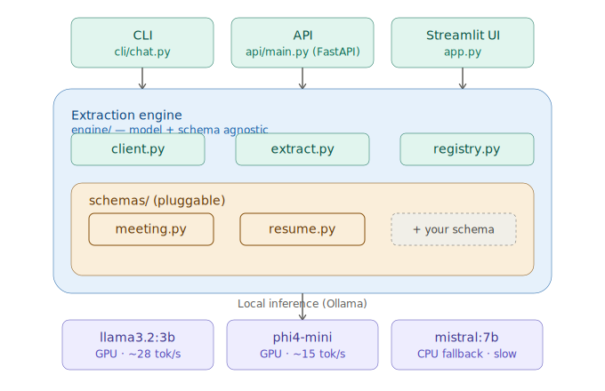

# Offline AI Assistant: A Local LLM-Powered Structured Information Extraction System

A fully offline, schema-agnostic extraction engine. It turns messy, unstructured text into validated structured JSON using local LLMs (via Ollama) — no cloud API, no data leaving the machine.

Meeting-note action-item extraction is the **first supported schema**, not the identity of the project. The engine itself has no knowledge of "meetings" — it takes a Pydantic schema and a document, and returns validated structured output for *any* document type registered with it.



## Why this exists

Most "LLM extraction" demos are hardcoded: one prompt, one output shape, one use case. That doesn't reflect how extraction is actually used in production — a real system needs to support new document types without rewriting its core. This project is built around that constraint: the engine, API, and CLI are all schema-agnostic, and adding a new document type is a matter of writing one schema file, not touching the engine.

## What it does

- Runs entirely offline against local models served by [Ollama](https://ollama.com) — no API keys, no internet dependency, no data sent anywhere
- Extracts structured, validated JSON from raw text using a pluggable schema registry
- Validates every extraction against a Pydantic model, with automatic retry on malformed output
- Benchmarks and evaluates multiple local models against each other on both speed and extraction accuracy
- Exposes the engine via CLI, REST API, and (optionally) a Streamlit UI

## Supported schemas

| Schema | Status | Description |
|---|---|---|
| `meeting` | Done | Extracts action items (task, owner, due date, priority) from meeting notes |
| `resume` | In progress | Extracts structured candidate info (skills, education, experience) from resume text |

Adding a new schema doesn't touch the engine — see [Adding a new schema](#adding-a-new-schema) below.

## Architecture

```
offline-ai-assistant/
├── engine/                 # model + schema agnostic core
│   ├── client.py           # single Ollama-calling function, used by everything else
│   ├── extract.py          # extract(text, schema_name) -> validated Pydantic object
│   └── registry.py         # maps schema_name -> (Pydantic model, prompt builder)
├── schemas/                 # one file per document type — this is what makes it a framework, not a script
│   ├── meeting.py
│   └── resume.py
├── api/
│   └── main.py              # FastAPI: /chat, /extract/{schema_name}
├── cli/
│   └── chat.py               # interactive CLI, calls the same engine as the API
├── benchmarks/
│   ├── benchmark.py           # tokens/sec, TTFT, latency across models
│   └── results.json / summary.csv
├── evaluation/
│   ├── dataset.json            # 25 hand-labeled golden samples
│   └── evaluate.py              # recall / precision / field accuracy per model
├── docs/
│   └── architecture.svg
├── app.py                        # Streamlit demo
└── requirements.txt
```

**The core design decision:** `engine/` never imports anything from `schemas/` directly — it goes through `engine/registry.py`. CLI, API, and evaluation all call the same `engine.extract.extract(text, schema_name)` function. Nothing about the engine changes when a new schema is added.

## Quickstart

**1. Install [Ollama](https://ollama.com/download) and pull the models used in this project:**
```bash
ollama pull llama3.2:3b
ollama pull mistral:7b
ollama pull phi4-mini
```

**2. Set up the Python environment:**
```bash
python -m venv venv
venv\Scripts\activate        # Windows
pip install -r requirements.txt
```

**3. Run it:**
```bash
# Interactive CLI
python cli/chat.py

# API server
uvicorn api.main:app --reload
# then open http://localhost:8000/docs
```

**4. Extract structured data via the API:**
```bash
curl -X POST http://localhost:8000/extract/meeting \
  -H "Content-Type: application/json" \
  -d '{"text": "John will finish the API integration by Friday.", "model": "llama3.2:3b"}'
```

## Results

### Model comparison: speed vs. accuracy

25-sample hand-labeled golden evaluation set, all models at temperature 0:

| Model | Recall | Precision | JSON Validity | Tokens/sec | Avg Latency |
|---|---|---|---|---|---|
| llama3.2:3b | 0.842 | 0.970 | 0.96 | 28.69 (GPU) | 27.7s |
| mistral:7b | 0.947 | 0.973 | 1.00 | 0.17 (CPU) | 626s |
| phi4-mini | 0.914 | 0.941 | 0.92 | 15.12 (GPU) | 16.5s |

**Finding:** `mistral:7b` is the most accurate on paper, but exceeds this machine's 4GB VRAM and falls back to CPU inference — over 600 seconds per extraction, which is impractical for real use. `phi4-mini` offers the best practical tradeoff: 91% recall at the fastest latency of the three, fully GPU-accelerated. Highest accuracy is not the same as the right engineering choice under real hardware constraints.

### Temperature and extraction consistency

5 repeated runs on the same input at temperature 0 vs. 0.7:

- **Temp 0:** identical task count and exact task wording across all 5 runs — fully deterministic in practice
- **Temp 0.7:** task count varied between runs (one run silently dropped an action item), and task phrasing drifted between runs even when the underlying task was the same

This is why extraction defaults to temperature 0: consistency matters more than output diversity for structured extraction, unlike temperature 0.7's intended use case of encouraging varied generation.

### Hardware constraint: GPU offload

`mistral:7b` initially crashed outright on this machine (GTX 1650, 4GB VRAM) with a CUDA initialization error — not a graceful fallback, a hard crash. Root cause: the model's memory footprint exceeds available VRAM. Fixed by forcing CPU-only inference for that specific model via a `CPU_ONLY_MODELS` set in `engine/client.py`, while `llama3.2:3b` and `phi4-mini` continue to run on GPU. This is documented rather than hidden, since deploying local LLMs under real hardware limits is a genuine constraint any offline system has to handle.

## Adding a new schema

This is the actual proof that the engine generalizes. To support a new document type:

**1. Define the schema and prompt** in `schemas/your_type.py`:
```python
from pydantic import BaseModel

class YourExtraction(BaseModel):
    field_one: str
    field_two: Optional[str]

def build_prompt(raw_text: str) -> str:
    return f"Extract ... from:\n{raw_text}\n\nJSON:"
```

**2. Register it** in `engine/registry.py`:
```python
"your_type": {"model": YourExtraction, "prompt_builder": build_prompt}
```

That's it. `engine/extract.py`, `api/main.py`, and `cli/chat.py` require zero changes — the new schema is immediately available via `extract(text, "your_type")` and `POST /extract/your_type`.

## Known limitations

- Field-level accuracy for free-text fields (e.g. `due_date`) is measured with exact string matching, which underestimates true accuracy since models phrase dates differently ("Friday" vs. "by Friday" vs. "end of week") — this is a scoring limitation, not purely a model failure
- Models occasionally infer optional fields (e.g. `priority`) that weren't explicitly stated in the source text, rather than returning `null` as instructed
- `mistral:7b` is impractically slow on consumer GPUs with <8GB VRAM; recommended only where accuracy strictly outweighs latency


## Tech stack

Python · Ollama · FastAPI · Pydantic · pandas · Streamlit (planned)
